# Actualizaciones del servidor
Con los comando update y upgrade. Después es necesario reiniciar.
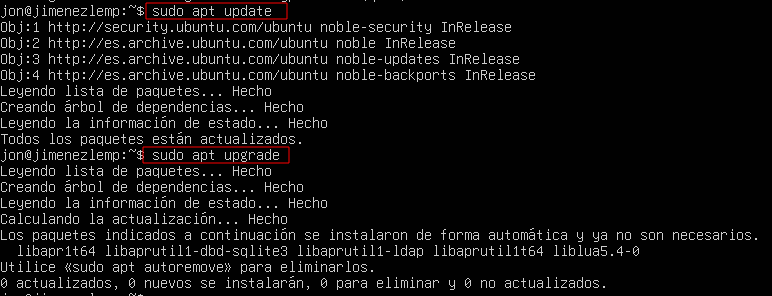

# Instalación de PHPAdmin
Podemos conectarnos vía ssh desde un cliente.

Con el siguiente comando.

### Para que sirven los apartado extras.
php-mbstring: Un módulo para gestionar cadenas no ASCII y convertir cadenas a diferentes codificaciones.
* php-zip: Esta extensión soporta la carga de ficheros .zip a phpMyAdmin.
* php-gd: Habilita el apoyo para la Biblioteca Gráfica GD.
* php-json: Proporciona a PHP apoyo para la serialización JSON.
* php-curl: Permite que PHP interactúo con diferentes tipos de servidores usando diferentes protocolos.

Después es necesario seleccionar apache2, aunque tengamos instalado Nginx.
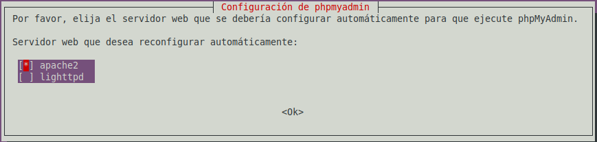

Ahora aceptaremos para que dbconfig-common pueda configurar la base de datos.
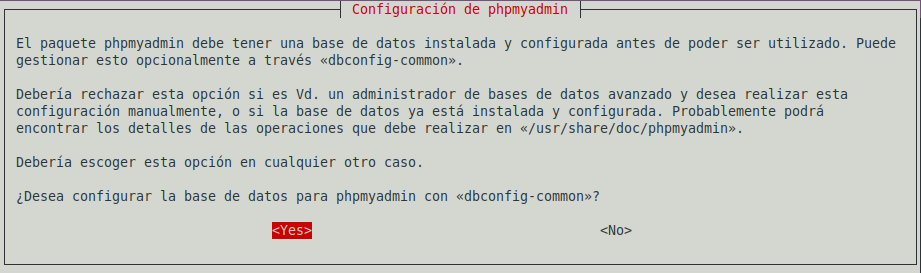

Escribimos la contraseña para phpmyadmin.
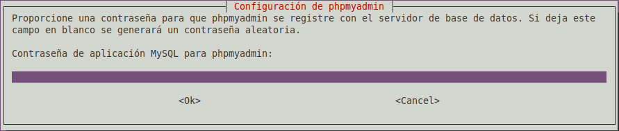

Para aplicar los cambios es necesario reiniciar el servidor.

Ahora crearemos en /etc/nginx/sites-availables, un fichero de configuración de nginx.
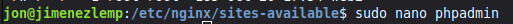

Editamos el fichero de la siguiente manera.
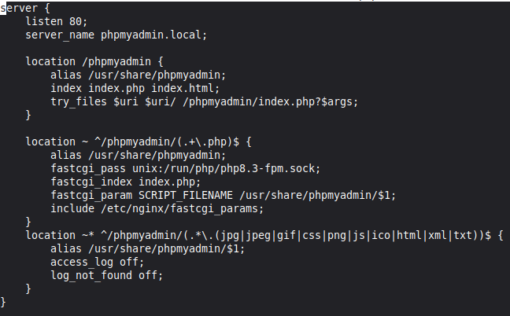

Hacemos el enlace simbólico con /etc/nginx/sites-enabled.
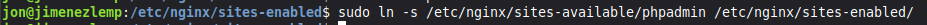

Comprobamos si hay algún fallo.

Reiniciamos y vemos el status de nginx.
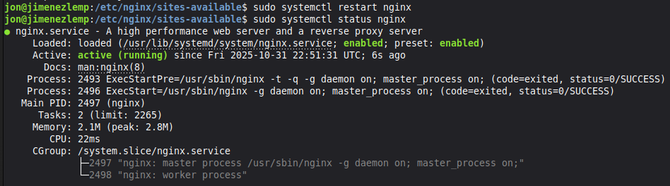

Es necesario modificar el fichero hosts.

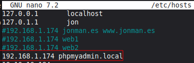

En un navegador podemos poner la url de la siguiente manera. 

El usuario es root y contraseña de MariaDB.
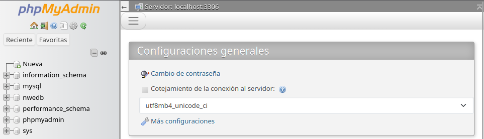

## Acceso por Contraseña del root de MariaDB
Entramos como root, a MariaDB, la contraseña es la que se puso durante la instalación.

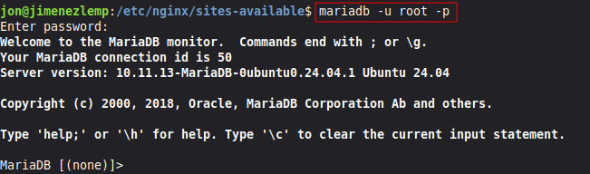

Si averiguamos la versión de MariaDB, en mi caso la 10.11.

Y luego introducimos el siguiente select, veremos que ya esta mysql_native_password.
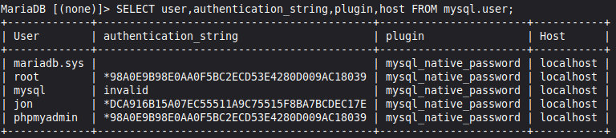

## Usuario dedicado de MariaDB
Crearemos el usuario dedicado dentro de MariaDB.

Podemos comprobar si entramos en PHPMyAdmin.
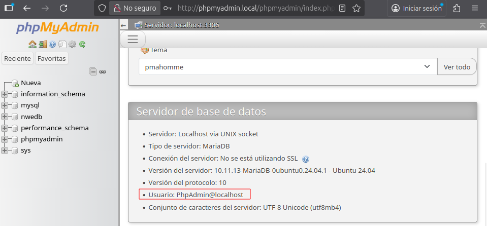

## Protección de PhpMyAdmin
Instalaremos apache-utils, aunque se use Nginx 

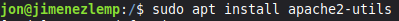

Ahora podemos usar htpasswd, para almacenar las credenciales de los usuarios en un fichero.
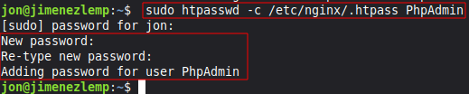

Para añadir mas usuarios sin sobrescribir el fichero se quita la -c del comando.

Ahora es necesario añadir un apartado al archivo que creamos antes para Nginx.

Comprobamos fallos.

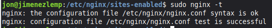

Recargamos el servicio.

Para proteger el fichero htpass, podemos cambiar de propietario con el grupo www-data.
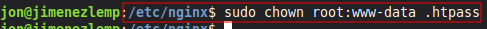

Y también podemos cambiar los permisos para que el propietario pueda leer y escribir, el grupo leer y los otros sin permisos.

## Scripts
Instalación de programas para LEMP.
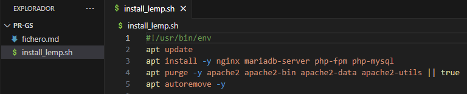

Instalación de PHPMyAdmin y htpsswd.
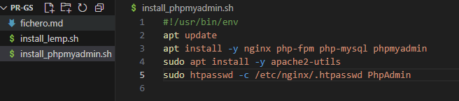

